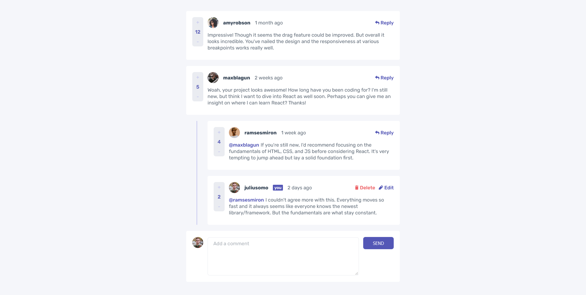

# Frontend Mentor - Interactive comments section solution

This is a solution to the [Interactive comments section challenge on Frontend Mentor](https://www.frontendmentor.io/challenges/interactive-comments-section-iG1RugEG9). Frontend Mentor challenges help you improve your coding skills by building realistic projects. 

## Table of contents

- [Overview](#overview)
  - [The challenge](#the-challenge)
  - [Screenshot](#screenshot)
  - [Links](#links)
- [My process](#my-process)
  - [Built with](#built-with)
  - [Depolyment](#deploy-process)
  - [What I learned](#what-i-learned)
  - [Continued development](#continued-development)
  - [Useful resources](#useful-resources)
- [Author](#author)
- [Acknowledgments](#acknowledgments)

## Overview

### The challenge

Users should be able to:

- View the optimal layout for the app depending on their device's screen size
- See hover states for all interactive elements on the page
- Create, Read, Update, and Delete comments and replies
- Upvote and downvote comments
- **Bonus**: If you're building a purely front-end project, use `localStorage` to save the current state in the browser that persists when the browser is refreshed.
- **Bonus**: Instead of using the `createdAt` strings from the `data.json` file, try using timestamps and dynamically track the time since the comment or reply was posted.

### Screenshot



### Links

- Solution URL: [Project solution link](https://github.com/alisariyer/comments-app)
- Live Site URL: [Live site url](https://compassionate-mclean-1d3ac8.netlify.app/)

[](https://app.netlify.com/sites/compassionate-mclean-1d3ac8/deploys)

## My process

### Built with

- Semantic HTML5 markup
- CSS custom properties
- Flexbox
- CSS Grid
- Mobile-first workflow
- [React](https://reactjs.org/) - JS library

### Deploy process

1. Install gh-pages from terminal: npm install gh-pages **--save-dev**
2. Add "homepage": "https://{username}.github.io" into package.json file after name, version etc. values
3. In package.json file in scripts value add again a key-value pair as:
4. "predeploy": "npm run build"
5. "deploy": "gh-pages -d build"
6. If you've not initilalized your git repository: "git init" **then** "git remote add origin your-github-repository-url.git"
7. Then run from terminal: "npm run deploy"
8. Choose in github pages as branch: gh-pages then publish.

### What I learned

I practices and learn CSS Grid layout, create two level structure by using same component and conditional rendering, also how to sort a JSON data by some of properties and filter, find etc.

```css
.card-header {
    grid-area: 1 / 1 / 2 / span 3;
}
.card-img {
    width: calc(var(--rem) * 3.6);
}
```

```js
const cards = data.comments
    .sort((a, b) => b.score - a.score)
    .map((comment) => {
      return ("Codes")
})
```

### Continued development

I'll focus in React.js deeply to make more modular application and also practice JavaScript challanges to have a good experience on JS. Grid CSS also I'll try to use more to learn well.

### Useful resources
https://stackoverflow.com/questions/979256/sorting-an-array-of-objects-by-property-values
https://stackoverflow.com/questions/586182/how-to-insert-an-item-into-an-array-at-a-specific-index-javascript
https://stackoverflow.com/questions/37141425/filter-return-true-or-false

## Author

- Website - [Ali Sariyer](https://www.alisariyer.com)
- Frontend Mentor - [@alisariyer](https://www.frontendmentor.io/profile/alisariyer)
- Twitter - [@sariyer_ali](https://www.twitter.com/sariyer_ali)

## Acknowledgments

Thank you for excellent React courses to [@bobziroll](https://www.twitter.com/bobziroll) and [@eveporcello](https://www.twitter.com/eveporcello).
